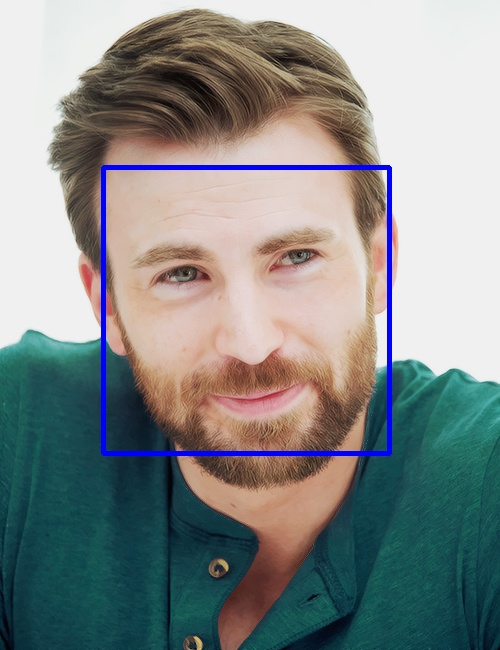

# FaceDetectionServer

基于 [SeetaFace](https://github.com/seetaface/SeetaFaceEngine) 的高性能人脸识别服务, 使用 Golang 与 CPP 混合开发.



# Requirements

please install them **yourself**. And make sure you are on **LINUX**.

- cmake3
- opencv
- jsoncpp

# Build and Usage

```
# 下载 SeetaFace 源码到 /src, 切换到指定版本并进行编译, 该过程需要 cmake3 支持
make seeta
# 编译胶水部分 c++ 代码, 提供可供 golang 使用的 c 语法 lib.
make faced
# 混合编译 golang/c++ 服务到单独二进制文件
make goserver
```

```
# 对服务进行命令行测试
$ http POST :8090/detection/upload < ./face.jpg
```

```json
HTTP/1.1 200 OK
Content-Length: 70
Content-Type: application/json
Date: Wed, 12 Oct 2016 02:47:09 GMT

{
    "face": [
        {
            "Y": 167,
            "height": 287,
            "width": 287,
            "x": 103
        }
    ],
    "size": [
        500,
        650
    ]
}
```
